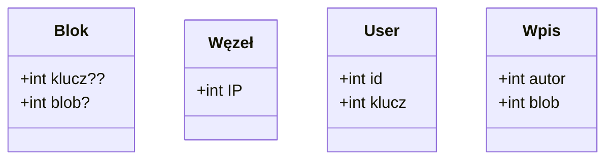

```mermaid

classDiagram
    class Blok{
      +int klucz??
      +int blob?
    }
    class Węzeł{
      +int IP
    }
    class User{
      +int id
      +int klucz
    }
    class Wpis{
      +int autor
      +int blob
    }
```
