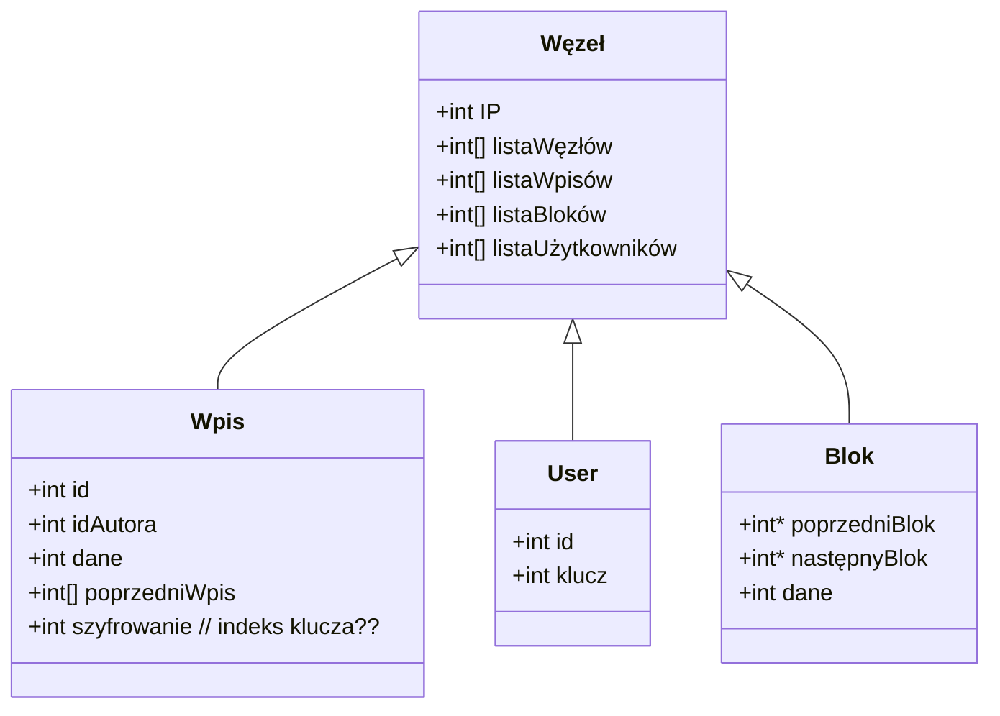

```mermaid

classDiagram
    class Blok{
        +int* poprzedniBlok
        +int* następnyBlok
        +int dane
    }
    class Węzeł{
        +int IP
        +int[] listaWęzłów
        +int[] listaWpisów
        +int[] listaBloków
        +int[] listaUżytkowników
    }
    class User{
        +int id
        +int klucz
    }
    class Wpis{
        +int id
        +int idAutora
        +int dane
        +int[] poprzedniWpis
        +int szyfrowanie // indeks klucza??
    }
    Węzeł <|-- Wpis
    Węzeł <|-- User
    Węzeł <|-- Blok
```
